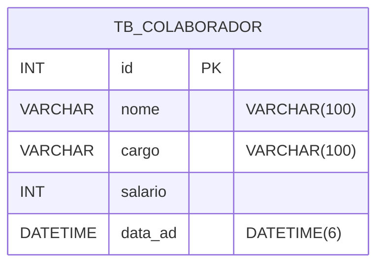

# RHizoma 🌳 — Onde pessoas criam raízes e crescem juntas.

O **RHizoma** é um sistema de gestão de Recursos Humanos (RH) desenvolvido como Projeto Integrador na **Generation Brasil (Turma JavaScript 12)**. A aplicação foca no cadastro e gerenciamento de colaboradores, oferecendo uma base sólida para a administração de capital humano em organizações que valorizam o crescimento conjunto.

***

## 📌 Sumário

1. [Visão Geral do Projeto](#-visão-geral-do-projeto)
2. [Público-alvo e Casos de Uso](#-público-alvo-e-casos-de-uso)
3. [Principais Funcionalidades](#-principais-funcionalidades)
4. [Tecnologias Utilizadas](#-tecnologias-utilizadas)
5. [Arquitetura e Banco de Dados](#-arquitetura-e-banco-de-dados)
6. [Requisitos do Sistema](#-requisitos-do-sistema)
7. [Instalação](#-instalação)
9. [Estrutura do Projeto](#-estrutura-do-projeto)
10. [Boas Práticas](#-boas-práticas)
11. [Como Contribuir](#-como-contribuir)

***

## 🔎 Visão Geral do Projeto

O **RHizoma** surge da necessidade de centralizar informações críticas de colaboradores. O nome faz alusão ao conceito botânico de rizoma — sistemas de raízes que se conectam e crescem horizontalmente — refletindo nossa visão de que o sucesso de uma empresa depende da conexão e do suporte entre seus membros.

***

## 👥 Público-alvo e Casos de Uso

### Quem deve ler este README?
- **Desenvolvedores e Avaliadores**: Que desejam entender a construção técnica da API.
- **Gestores de RH**: Interessados em uma solução simplificada para controle de pessoal.

### Exemplos de cenários de uso
- Consultar todos os colaboradores.
- Consultar por ID.
- Consultar por cargos.
- Cadastro de novos colaboradores.
- Atualizar informações do colaborador.
- Excluir colaborador.

***

## ✅ Principais Funcionalidades

- 👤 **Gestão de Colaboradores**: CRUD completo (Criar, Ler, Atualizar e Deletar) de informações dos Colaboradores.
- 📅 **Registro de Admissão**: Controle preciso da data de entrada no sistema.
- 🔍 **Busca Filtrada**: Localização de colaboradores por cargo ou ID.

***

## 🚀 Tecnologias Utilizadas

- **Node.js** & **NestJS**: Framework progressivo para construção de aplicações server-side eficientes.
- **TypeScript**: Adição de tipagem estática ao JavaScript para maior segurança.
- **MySQL**: Banco de dados relacional para persistência de dados.
- **TypeORM**: Ferramenta de mapeamento objeto-relacional para integração com o banco.
- **Class Validator**: Validação de dados de entrada nos DTOs.

***

## 🧱 Arquitetura e Banco de Dados

O projeto segue a arquitetura modular do NestJS, dividindo as responsabilidades em **Controllers** (rotas), **Services** (regras de negócio) e **Entities** (mapeamento do banco).

### Modelo de Dados (Tabela `tb_colaborador`)
Conforme o diagrama, a entidade principal possui os seguintes atributos:
- `id`: Identificador único (Primary Key).
- `nome`: Nome completo do colaborador (VARCHAR).
- `cargo`: Função exercida (VARCHAR).
- `salario`: Valor da remuneração (INT/DECIMAL).
- `data_ad`: Data de admissão (DATETIME).



***

## ▶️ Como executar o projeto

### 📋 Pré-requisitos
1. **Node.js** (v18 ou superior)
2. **MySQL** (v8.0 ou superior)
3. Gerenciador de pacotes (**npm** ou **yarn**)

### 🚀 Passo a passo
1. Clone o repositório:
```bash
git clone https://github.com/SEU-USUARIO/rhizoma-backend.git
```
2. Entre na pasta:
```bash
cd rhizoma-backend
```
3. Instale as dependências:
```bash
npm install
```
4. Execute a aplicação em modo de desenvolvimento:
```bash
npm run start:dev
```

***

### 📂 Estrutura do Projeto
```bash                 
├── node_modules            
├── src
│   ├── colaborador
│   │   ├── controllers
│   │   │   └── colaborador.controller.ts   
│   │   ├── entities
│   │   │   └── colaborador.entity.ts       
│   │   ├── services
│   │   │   └── colaborador.service.ts      
│   │   └── colaborador.module.ts           
│   ├── app.controller.ts                   
│   ├── app.module.ts                       
│   ├── app.service.ts                      
│   └── main.ts                             
├── test                                   
├── .gitignore
├── .prettierrc
├── eslint.config.mjs
├── nest-cli.json
├── package.json
├── package-lock.json
├── README.md
├── tsconfig.build.json
└── tsconfig.json
```

***

## 📏 Boas Práticas e Padrões do Projeto
 - Padrões de código
    - Siga o guia de estilo definido (ex.: ESLint, PEP8, SonarLint etc.).
    - Nomeie módulos e arquivos de forma clara e consistente.
 - Commits
    - Use mensagens de commit descritivas.
    - Sugestão: padrão semântico (ex.: feat:, fix:, docs:, chore:).
 - Testes
    - Escreva testes para novas funcionalidades.
Não quebre testes existentes sem justificativa e atualização adequada.
 - Logs e monitoramento
    - Use níveis de log adequados (info, warn, error, debug).
    - Evite logar dados sensíveis.

## 🤝 Como Contribuir

1. Faça um fork do repositório (se aplicável).
2. Crie uma branch descritiva:
```bash
git checkout -b feat/nome-da-funcionalidade
```
3. Implemente a funcionalidade ou correção, seguindo:
    - Padrões de código
    - Padrão de testes
4. Execute os testes antes de enviar:
```bash
npm test
```
5. Abra um Pull Request, descrevendo:
    - O problema resolvido ou funcionalidade criada.
    - Passos para testar.
    - Impactos em outras partes do sistema (se houver).

***

<table>
  <tr>
    <td align="center"><a href="https://www.linkedin.com/in/alberto-janeiro"><br /><sub><b>Alberto Durán</b></sub></a><br />❤️</td>
    <td align="center"><a href="https://www.linkedin.com/in/andrecesar-dev/"><br /><sub><b>André Cesar </b></sub></a><br />❤️</td>
    <td align="center"><a href="https://www.linkedin.com/in/brunamelodev/"><br /><sub><b>Bruna Melo</b></sub></a><br />❤️</td>
    <td align="center"><a href="https://www.linkedin.com/in/giovannaroberta/"><br /><sub><b>Giovanna Roberta</b></sub></a><br />❤️</td>
    <td align="center"><a href="https://www.linkedin.com/in/jacqueline-cardeal/"><br /><sub><b>Jacqueline Cardeal</b></sub></a><br />❤️</td>
    <td align="center"><a href="https://www.linkedin.com/in/renato-sales-desenvolvedor/"><br /><sub><b>Renato Sales</b></sub></a><br />❤️</td>
  </tr>
</table>

